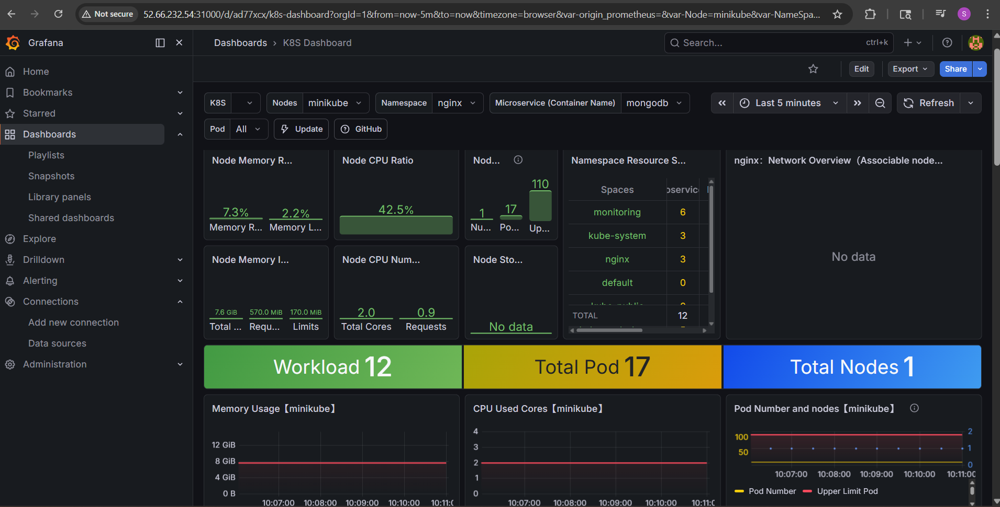
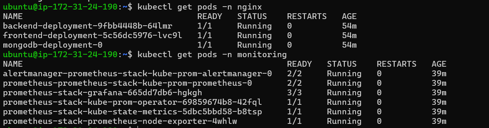

# Monitoring & Alerting System

Deployed Prometheus and Grafana on Kubernetes using Helm.

## Tools Used
- Kubernetes
- Helm
- Prometheus
- Grafana

## Commands

kubectl create namespace monitoring

helm repo add prometheus-community https://prometheus-community.github.io/helm-charts

helm install monitoring prometheus-community/kube-prometheus-stack -n monitoring

## Features
- Pod Monitoring
- CPU / Memory Metrics
- Dashboards
- Alerts
## Screenshots

### Grafana Dashboard

### Running Pods

